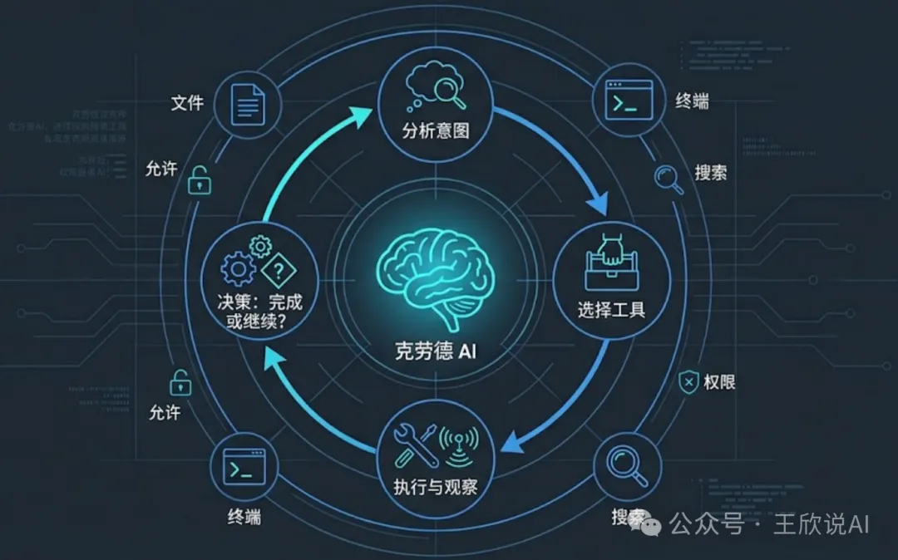
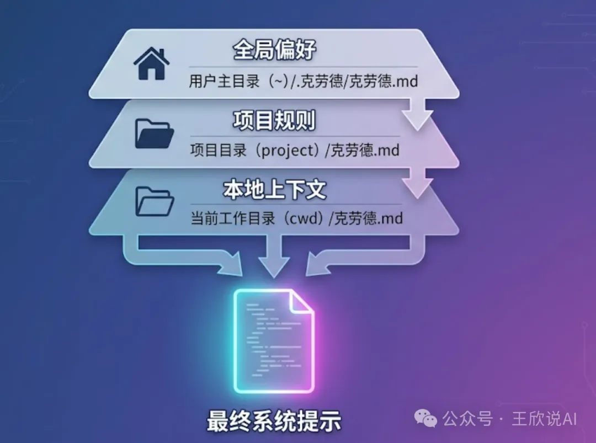
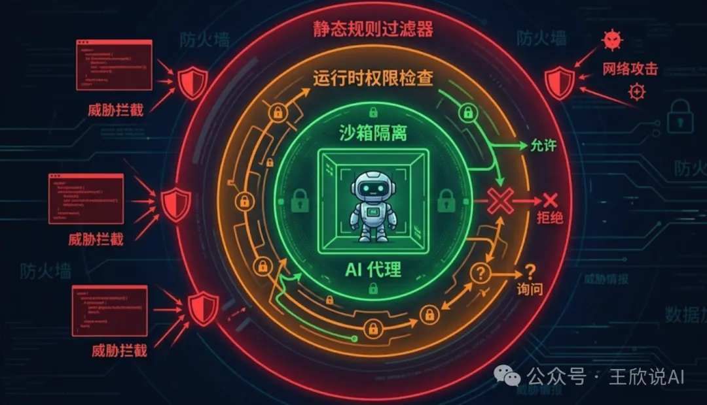
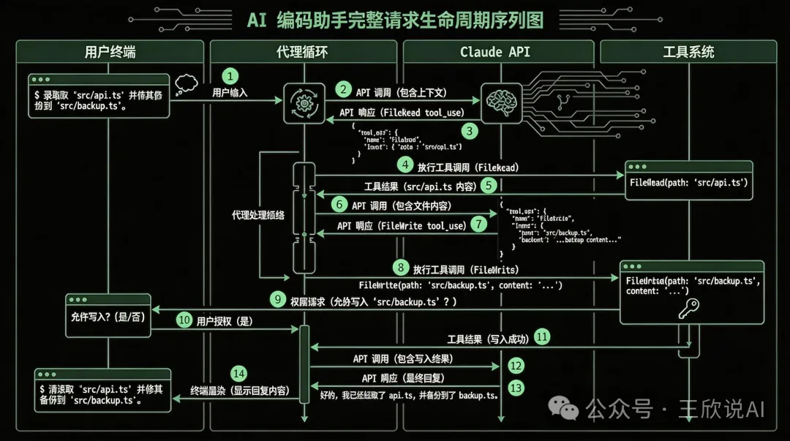

# 写在前面

最近Claude Code“自我开源” 有人将代码放到github.com/claude-code-best/claude-code 了

我们刚好有机会看看Claude Code引擎是如何运转的？本文将带你深入 Claude Code 2.1.88 的技术架构，从顶层设计到底层实现，全方位拆解这款改变了无数开发者工作方式的 AI 编程助手。

在众多 AI 编程工具中，Claude Code 以其**终端原生**的设计哲学独树一帜——它没有选择做一个 IDE 插件，而是直接驻扎在开发者最熟悉的终端里，用一种近乎"结对编程"的方式与你协作。

这种设计选择背后，是一套精巧的技术架构在支撑。今天，我们就来拆解它。

# 一、从 30000 英尺俯瞰：整体架构

Claude Code 的架构可以用一句话概括：**分层解耦、工具驱动、AI 编排**。

如果把它比作一个人，那么：

**CLI 入口层**是它的「耳朵和嘴巴」——负责接收你的输入、展示输出

**应用层**是它的「大脑」——负责理解意图、规划行动、协调执行

**UI/终端层**是它的「表情」——负责将复杂的执行过程可视化呈现

**外部服务层**是它的「工具箱」——Claude API、MCP 服务器、分析系统等

```text
 ╔════════════════════════════════════════════════════════════════╗
 ║                      CLI Entry Layer                          ║
 ║  ┌──────────────────┐ ┌───────────────┐ ┌──────────────────┐  ║
 ║  │ Commands Handler │ │  Background   │ │  Remote Control  │  ║
 ║  │                  │ │  Sessions     │ │                  │  ║
 ║  └──────────────────┘ └───────────────┘ └──────────────────┘  ║
 ╠════════════════════════════════════════════════════════════════╣
 ║                     Application Layer                         ║
 ║  ┌──────────────────┐ ┌───────────────┐ ┌──────────────────┐  ║
 ║  │ State Management │ │ Tools System  │ │  Agent System    │  ║
 ║  └──────────────────┘ └───────────────┘ └──────────────────┘  ║
 ╠════════════════════════════════════════════════════════════════╣
 ║                    UI / Terminal Layer                        ║
 ║  ┌──────────────────┐ ┌───────────────┐ ┌──────────────────┐  ║
 ║  │    Ink React     │ │ Event System  │ │    Terminal      │  ║
 ║  │                  │ │               │ │    Interface     │  ║
 ║  └──────────────────┘ └───────────────┘ └──────────────────┘  ║
 ╠════════════════════════════════════════════════════════════════╣
 ║                     External Services                         ║
 ║  ┌──────────────────┐ ┌───────────────┐ ┌──────────────────┐  ║
 ║  │ Claude API       │ │  MCP Servers  │ │   Analytics      │  ║
 ║  │ Integration      │ │               │ │   System         │  ║
 ║  └──────────────────┘ └───────────────┘ └──────────────────┘  ║
 ╚════════════════════════════════════════════════════════════════╝
```

这四层之间通过清晰的接口通信，每一层都可以独立演进，互不影响。这种分层设计让 Anthropic 的团队可以并行开发不同模块，同时保持系统的整体稳定性。

------

# 二、核心模块深度拆解

## 2.1 命令系统：一切交互的起点

当你在终端输入/help、/compact、/model这些斜杠命令时，背后是 Claude Code 的**命令注册中心**在响应。这套命令系统采用了经典的**插件化架构**——每个命令都是一个独立模块，通过统一接口注册到系统中，添加新命令就像插入乐高积木一样简单。

更值得注意的是它的**权限控制机制**。每个命令都有独立的权限检查——这就是为什么 Claude Code 在执行文件写入或 Bash 命令时会弹出确认提示。这种设计在保证功能强大的同时，也给了用户充分的安全感。

## 2.2 工具系统：真正的「瑞士军刀」

如果说命令系统是入口，那么工具系统才是 Claude Code 真正的核心引擎。所有工具共享统一的接口定义——名称、描述、JSON Schema 输入规范、执行函数和权限声明。

```ts
// src/Tool.ts - 工具接口定义
export type Tool = {
  name: string;
  description: string;
  inputSchema: JSONSchema;
  execute: (context: ToolUseContext) => Promise<ToolResult>;
  permissions: Permission[];
};
```

Claude Code 的工具分为五大类，每一类都针对开发场景精心设计：

| 工具类别 | 代表工具 | 核心能力 |
| --- | --- | --- |
| 📁 文件操作 | FileReadTool、FileWriteTool、FileEditTool | 读写文件、精确编辑 |
| 🖥️ 系统工具 | BashTool、PowerShellTool | 执行系统命令 |
| 🤖 AI 工具 | AgentTool、AskUserQuestionTool | 子任务委派、用户交互 |
| 🔍 搜索工具 | GrepTool、GlobTool | 代码搜索、文件匹配 |
| 🔌 MCP 工具 | MCP Client | 第三方扩展集成 |

## 2.3 查询引擎：系统的「总指挥」

查询引擎是整个系统中最核心的模块。它负责**理解需求 -> 制定计划 -> 分配任务 -> 整合结果**。当你说「帮我重构这个函数，把它拆成三个小函数」时，查询引擎会识别出重构意图，规划出"读取->分析->拆分->验证"的执行路径，依次调用相应工具，最终将结果组织成清晰的回复。整个过程中，Claude API 充当"决策大脑"，工具系统则是"执行双手"。

## 2.4 终端 UI：在字符中构建世界

Claude Code 的终端界面是用**React + Ink**构建的——React 渲染的目标不是浏览器 DOM，而是终端字符。这意味着声明式 UI、组件复用（进度条、代码高亮、Diff 显示等）、响应式状态更新这些现代前端能力，全部被带入了终端世界。

## 2.5 状态管理：记住一切

Claude Code 使用**Redux + React Context + Immer**的混合方案管理状态。会话、历史消息、工具执行状态、权限配置、用户偏好……这些状态之间存在复杂的依赖关系，通过 Immer 的不可变更新确保状态变化的可预测性和可追踪性。

## 2.6 MCP 集成：打开无限可能的大门

**MCP（Model Context Protocol）**是 Anthropic 推出的开放协议。通过 MCP，Claude Code 可以连接到数据库查询工具、Jira/Linear 等项目管理系统、自定义内部工具链，以及任何实现了 MCP 协议的服务。这种开放式设计让它从一个"编程助手"进化成了一个**可扩展平台**。

## 2.7 智能记忆系统：越用越懂你

Claude Code 内置了一套**记忆系统**，用于存储和检索跨会话的上下文信息。你可以通过CLAUDE.md文件告诉它你的项目偏好，而它能在后续的每次交互中记住这些偏好。记忆系统让 AI 助手不再是"无状态"的，而是真正成为了了解你的代码库和工作习惯的长期搭档。

------

# 三、深入源码：六大核心竞争力

> 以上是架构概览。接下来我们钻进源码，挖掘 Claude Code 在工程实现层面真正拉开差距的核心设计。

## 3.1 Agent Loop：从"问答"到"自主执行"的范式跃迁

这是 Claude Code 区别于所有代码补全工具的**根本架构差异**。它的核心不是"用户提问 -> AI 回答"的单轮模式，而是一个**自主循环的 Agent Loop**：

```ts
async function agentLoop(userMessage: string, context: ConversationContext) {
  context.messages.push({ role: "user", content: userMessage });

  while (true) {
    const response = await callClaudeAPI({
      messages: context.messages,
      tools: getAvailableTools(),
      system: buildSystemPrompt(context),
    });

    // 纯文本回复 -> 任务完成，退出循环
    if (response.stopReason === "end_turn") {
      return response.content;
    }

    // AI 请求调用工具 -> 执行后继续循环
    if (response.stopReason === "tool_use") {
      for (const toolCall of response.toolCalls) {
        const result = await executeToolWithPermissionCheck(toolCall);
        context.messages.push({ role: "tool", toolUseId: toolCall.id, content: result });
      }
      continue; // 关键：不 return，让 AI 基于工具结果继续推理
    }
  }
}
```



**这为什么如此重要？**当你说「修复所有 TypeScript 编译错误」，Agent Loop 会驱动 Claude Code 自动循环：运行tsc获取错误 -> 读取文件 -> 修复 -> 再次运行tsc验证 -> 发现还有错误 -> 继续修复……直到编译通过。整个过程完全由 AI 自主驱动，循环深度没有硬编码上限，AI 自己判断何时结束。

这种"自愈式"执行在实际使用中的效果是：你给出一个高层意图，Claude Code 像一个独立工作的工程师一样，端到端地完成任务——包括处理中途出现的意外情况。

**AgentTool 更进一步**——它允许主智能体创建子智能体来处理子任务，每个子智能体有独立的上下文窗口。这本质上是**MapReduce 思想在 AI Agent 中的应用**：面对"把项目从 Webpack 迁移到 Vite"这样的复杂任务，主智能体可以并行委派多个子智能体分别分析配置、搜索依赖、生成新配置，最后汇总结果。子智能体之间互不干扰，也不会撑爆主对话的 token 限制。

## 3.2 多层记忆架构：让 AI 真正理解"你"

Claude Code 的 System Prompt 不是一段静态文本，而是一个**由至少五个层级动态组装的上下文系统**：基础身份准则、运行环境感知（操作系统、Shell、当前目录、Git 分支）、可用工具描述、CLAUDE.md 记忆内容，以及项目元信息。

其中最精妙的是**CLAUDE.md 的三级加载机制**：

**全局级** `~/.claude/CLAUDE.md`：你的个人偏好，跨所有项目生效——比如「我偏好函数式风格，commit message 用英文」

**项目根级** `{projectRoot}/CLAUDE.md`：项目规范，团队共享——比如「使用 Zustand 管理状态，测试用 Vitest」

**当前目录级** `{cwd}/CLAUDE.md`：子模块特定规范——比如「这个目录下是数据库迁移脚本，请格外谨慎」

三层规则**自动合并、逐级细化**，让同一个 AI 在不同项目、不同目录下表现出不同的行为模式。再加上 `.claude/settings.json` 中的用户记忆条目，Claude Code 实际上构建了一套**分层的 AI 工作手册**，远比任何竞品的"自定义 prompt"机制更精细。



## 3.3 三层纵深安全体系：在危险中起舞

AI 直接操作文件系统和执行 Shell 命令——这在安全上极其敏感。Claude Code 用**三层纵深防御**解决这个问题：

**第一层：静态规则过滤。**工具注册时就预定义了危险模式黑名单。BashTool 会在执行前用正则匹配拦截 `rm -rf /`、`curl | bash`、Fork 炸弹、直接写磁盘设备等明确的破坏性命令。这些规则硬编码在工具内部，无法被 AI 绕过。

**第二层：运行时权限决策。**每次工具调用前，PermissionManager 实时判断三种处理路径——只读操作自动放行、用户已授权的模式匹配通过后自动放行、其余弹出交互式确认。关键是这里引入了**信任递进模型**：系统会记住你的授权决策，当你多次允许同类操作后，会提示"是否始终允许此类操作"，写入 settings 后续自动放行。这让新用户得到充分保护，而熟练用户不被反复打断。

**第三层：执行沙箱。**即使命令通过了前两层，BashTool 在实际执行时仍施加约束——工作目录限制（不能逃逸出项目根目录）、执行超时（默认 120 秒）、输出截断（防止超大输出撑爆内存，采用首尾保留策略保留最有价值的信息）、进程隔离（子进程异常不影响主进程）。

这三层的叠加效果是：**安全不是对能力的限制，而是一个功能特性**。用户可以放心地让 AI 执行命令，因为每一步都有兜底。



## 3.4 智能上下文管理：在有限窗口中做无限的事

LLM 的上下文窗口是有限资源。当长对话逼近 200K token 上限时，如何保留最有价值的信息？Claude Code 的 `/compact` 命令背后是一套**AI 驱动的摘要压缩算法**，而不是简单的"删除旧消息"：

System Prompt 永远保留（不可压缩），最近 N 轮对话完整保留（近期记忆），而更早的历史对话则**交给 Claude 自己做摘要**——提炼关键决策、文件修改状态、未完成任务等。用户还可以通过 `/compact` 指定摘要关注点。这就像一个优秀的会议记录员：不逐字记录，而是提炼行动项。

与此配合的是**Prompt Caching 的深度利用**。源码显示，Claude Code 在 System Prompt 末尾和对话历史的关键断点处设置了 `cache_control` 标记。由于 System Prompt + CLAUDE.md 在整个会话中几乎不变，每次 API 调用都能缓存命中，加上对话历史前半部分也基本稳定。实际效果是，长对话中的整体成本可降低**50-70%**，同时响应延迟也因缓存命中而显著降低。

Claude Code 还内置了一套**精确到 cache hit/miss 的成本追踪系统**：每次 API 调用的 input/output tokens、缓存写入和命中 tokens 全部被记录。终端中实时显示的 token 计数和费用估算来源于此，甚至能告诉你 Prompt Caching 为你节省了多少钱。这种成本透明度在同类产品中极为罕见。

## 3.5 精准编辑策略：搜索-替换优于行号

Claude Code 修改文件时不是全文覆盖，而是采用**基于搜索-替换的精准编辑**——AI 必须提供要替换的精确文本片段和替换后的内容。系统会校验匹配唯一性：找不到匹配则报错，找到多个匹配也报错（迫使 AI 提供更多上下文以精确定位）。

这个设计看似简单，实则深思熟虑。在 Agent Loop 中，AI 可能连续执行多次编辑，前一次编辑会改变行号，如果用行号定位后续编辑就会出错。搜索-替换天然避免了这个问题。同时，这种方式有很强的自描述性——AI 必须"说出"它要改什么、改成什么，方便人类在确认环节快速审查。最后，LLM 擅长生成文本片段而非精确计算行号，这种设计与模型的能力特征高度对齐。

## 3.6 流式渲染与工具可视化：让等待消失

Claude API 返回的是一个 token 流。Claude Code 构建了一套完整的**流式处理管线**：逐 token 接收、实时 Markdown 解析（检测代码块边界进行语法高亮）、逐行渲染到终端。当 AI 决定调用工具时，终端会实时展示工具名称、参数和执行状态。整个流程的效果是**零延迟感知**——第一个 token 到达就开始渲染，用户永远不会面对空白屏幕。

配合 React + Ink 的声明式渲染，Diff 视图、进度指示器、工具调用状态等复杂 UI 元素在流式过程中实时更新，不需要手动管理任何刷新逻辑。这也是 Claude Code 终端体验之所以"不像终端"的技术根源。

------

# 四、技术栈全景图

| 层级 | 技术 | 选择理由 |
| --- | --- | --- |
| UI 层 | React 19 + Ink 6.8 | 声明式终端 UI，开发体验好 |
| 状态管理 | Redux Toolkit + Context | 复杂状态的可预测管理 |
| 不可变数据 | Immer | 状态安全更新，配合 Redux DevTools |
| 构建工具 | ESBuild | 极速构建，毫秒级热更新 |
| 包管理 | Bun | 高性能安装和脚本执行 |
| 类型系统 | TypeScript 5+ | 大型项目的类型安全保障 |
| 网络层 | Fetch + WebSocket | 标准 API + 实时通信 |
| 日志系统 | Winston + OpenTelemetry | 生产级日志和分布式追踪 |
| 进程管理 | execa | 跨平台子进程管理，用于 Bash/MCP 执行 |

值得一提的是**Bun**的使用——Claude Code 选择它作为包管理器，很大程度上是为了优化启动速度。对于 CLI 工具来说，冷启动时间直接决定用户体验。

------

# 五、一次请求的完整生命周期

让我们追踪一个真实请求的完整旅程：



用户输入: "帮我给 utils.ts 中的 parseDate 函数添加单元测试"

```text
用户输入: "帮我给 utils.ts 中的 parseDate 函数添加单元测试"
  │
  ▼
┌──────────────────────────────────────────────────────────────┐
│ ❶ CLI 层接收输入                                    【图 ①】 │
│   终端捕获输入 -> 传递给应用层 -> token 计数启动             │
└─────────────────────────────┬────────────────────────────────┘
                              ▼
┌──────────────────────────────────────────────────────────────┐
│ ❷ 上下文组装                                        【图 ②】 │
│   System Prompt + CLAUDE.md（三级合并）+ 对话历史            │
│   + 可用工具列表 + Prompt Caching 断点设置                   │
└─────────────────────────────┬────────────────────────────────┘
                              ▼
┌──────────────────────────────────────────────────────────────┐
│ ❸ Agent Loop 自主循环                            【图 ③~⑬】 │
│                                                              │
│   循环 1: FileReadTool -> 读取 utils.ts                      │
│   循环 2: GlobTool -> 发现测试文件命名规范                   │
│   循环 3: FileWriteTool -> 创建 utils.test.ts                │
│   循环 4: BashTool -> npx vitest run                         │
│   循环 5: FileEditTool -> 修复失败的测试用例                 │
│   循环 6: BashTool -> npx vitest run -> 3 passed             │
│                                                              │
└─────────────────────────────┬────────────────────────────────┘
                              ▼
┌──────────────────────────────────────────────────────────────┐
│ ❹ 流式渲染 & 状态持久化                            【图 ⑭】 │
│   全过程通过 Ink/React 实时渲染到终端                        │
│   Token 用量和费用实时更新                                  │
│   对话历史持久化到会话存储                                   │
└──────────────────────────────────────────────────────────────┘
```

注意 Agent Loop**循环了 6 次**，其中包括了"发现测试失败 -> 自动修复 -> 重新验证"的自愈过程，全程无需用户干预（除了权限确认）。

------

# 六、与同类产品的架构对比

| 维度 | Claude Code | GitHub Copilot | Cursor |
| --- | --- | --- | --- |
| 运行环境 | 终端原生 | IDE 插件 | 独立 IDE |
| UI 框架 | React + Ink | VS Code Extension API | Electron + React |
| 核心范式 | 自主 Agent Loop | 补全 + Chat | 编辑器增强 + Agent |
| 扩展机制 | MCP 协议（开放标准） | 有限 API | 私有协议 |
| 工具执行 | 本地直接执行 | 受限于 IDE 沙箱 | 本地执行 |
| 上下文管理 | 智能压缩 + Prompt Cache | 固定窗口 | 固定窗口 + RAG |
| 成本透明度 | 实时 token/费用追踪 | 订阅制，无细节 | 订阅制，无细节 |
| 设计哲学 | 终端优先、工具驱动 | 编辑器嵌入、补全优先 | IDE 融合、编辑器增强 |

更深层的差异在于产品定位：**Copilot**的核心是"补全"——在你打字间隙生成建议，本质是高级自动补全。**Cursor**的核心是"编辑器增强"——它增强了编辑体验，但仍受制于 IDE 框架。**Claude Code**的核心是"自主执行"——它不只是建议，而是直接动手，Agent Loop 让它能端到端地完成从分析到编码到测试到修复的完整工作流。

Claude Code 的「终端原生」策略看似逆潮流，实则精准地抓住了一个痛点：**真正的高效开发者，从不离开终端**。

------

# 七、写给开发者的架构启示

从 Claude Code 源码中可以提炼出几个**在自己的 AI 应用中可复用的架构模式**：

**Agent Loop 优于单次调用。**不要把 LLM 当成一个函数，而是一个持续运行的决策引擎。让 AI 自主决定何时调用工具、何时寻求信息、何时结束任务。这一个架构选择就能让应用从"玩具"升级为"工具"。

**工具接口标准化。**定义统一的 Tool 接口，让所有工具对 AI 一视同仁。无论是内置工具还是 MCP 外部工具，对 AI 来说都是一样的。这种透明代理设计让扩展变得无缝。

**分层记忆系统。**全局偏好 + 项目规范 + 本地上下文 -> 多级合并。让 AI 在不同场景下表现出不同行为，而不是一套固定人设。

**安全是渐进信任，不是二元开关。**让用户通过使用过程"训练"权限系统，兼顾安全与效率，远好于简单的黑白名单。

**成本透明化是用户信任的基础。**每一个 token 都被追踪和展示。Prompt Caching 不是可选优化，而是默认启用的核心策略。当用户能看到 AI 为他们省了多少钱时，信任感是完全不同的。

------

# 八、总结与展望

通过这次深度拆解，我们可以看到 Claude Code 并非简单地将 AI 模型封装成命令行工具。它的背后是一套经过精心设计的工程体系：**Agent Loop**赋予了它自主执行复杂任务的能力，**分层记忆架构**让它在不同场景中行为得体，**三层安全机制**让用户放心地交出文件系统的操控权，**Prompt Caching + 智能压缩**让长对话的成本和延迟都保持可控，**MCP 协议**打开了生态共建的大门。

可以预见的是，随着 AI 能力的持续提升，Claude Code 的架构也将持续演进。更多的模型集成、云原生部署支持、更丰富的插件生态……这些都已经在路上了。

对于我们开发者而言，Claude Code 不仅仅是一个好用的工具——它更是一个**学习现代 AI Agent 架构设计的活教材**。它向我们展示了如何将 AI 能力与传统软件工程完美融合，如何在功能强大与使用安全之间找到平衡，如何通过开放协议构建生态，以及如何在每一个工程细节中追求极致。

下次当你在终端里和 Claude Code 对话时，不妨多想想：此刻你的输入，正在经历怎样奇妙的旅程。

