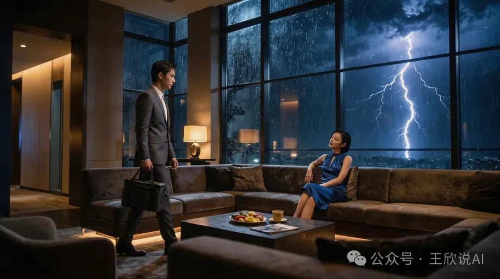
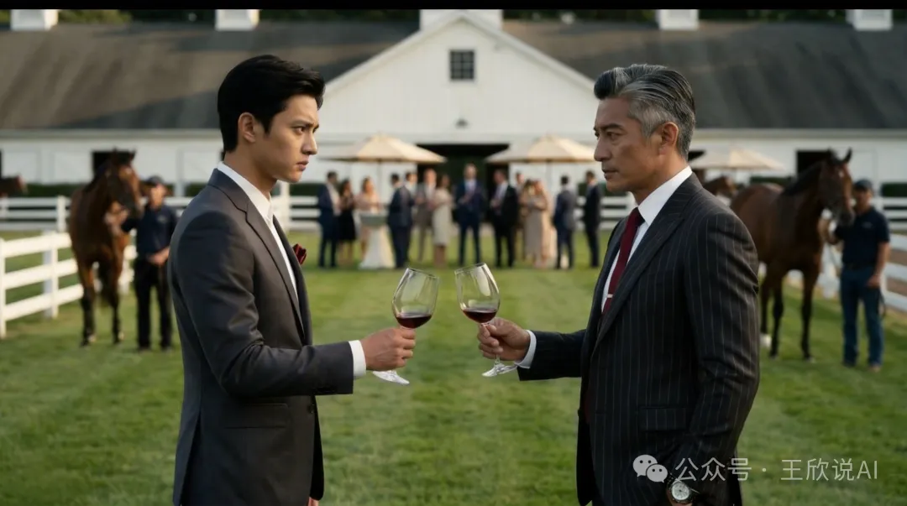
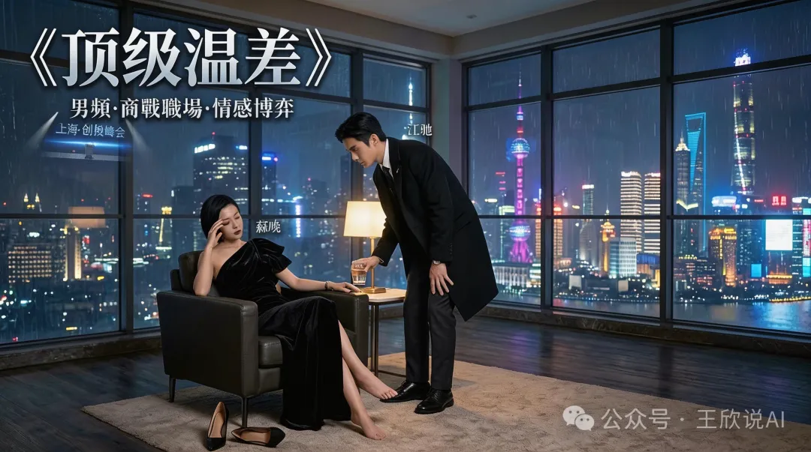

> *"你能不能别光写，直接拍个短剧？"*
>
> *半年前同学群里的一句起哄，让一个写代码的跑去拍短剧了——纯属玩票，但还真玩出来了。*

------

# 一切的起点：一份全网争议的PDF

2025年11月，一份名为《人妻约会指南》的PDF在网络上疯传。

作者李新野，清华姚班出身，在近百页的文档里，讲述自己与已婚女性婚外关系的经历，还试图搬出进化心理学、博弈论来为自己"正名"。

一时间全网哗然。

当时我在一个同学微信群里，大家都在讨论这件事。我说了一句：

> "AI这么强了，我来写一个《男小三上位指南》——用镜像他的逻辑结构，反过来揭示这套理论有多荒谬。**讽刺，不要模仿。**"

说干就干。我先让大模型生成了一版**学术版**的《男小三上位指南》，结构严谨，引经据典，逻辑自洽。

群里的女同学看完后：

> "太干了吧……又学术又不好看。你能不能整点人话？"

好，那我就把学术版喂给大模型，让它改写成小说。

大模型不到一个小时，就吐出了一部都市情感小说——

《顶级温差》。

群里炸了。同学们看完后纷纷表示：

> "欣哥太会玩了！""但是……你能不能直接出个短剧？"

------

# 从小说到短剧：一个执念的兑现

当时因为工具和时间的原因，这件事搁置了。

但这个念头一直在我心里。

我先把小说发布到了**番茄免费小说APP**（搜索"顶级温差"即可阅读），又用**喜马拉雅APP**的TTS功能发布了音频版《温差》。

小说有了，音频有了，就差一个短剧。

最近终于有了时间，也找到了合适的AI工具——

我决定把当初那个承诺兑现了。

------

# 一个人，零基础，怎么做短剧？

先说我的背景：

💻 职业：程序员

🎬 拍摄经验：零

🎭 演员资源：零

👥 制作团队：零

💰 预算：极低

小说是AI写的。剧本是AI改的。视频是AI生成的。

整个制作流程，从文字到画面，完全由AI工具链完成。没有请一个演员，没有租一台摄像机，没有组一个团队。

就是我一个人，一台电脑，和一堆AI工具。

这件事本身可能比短剧还魔幻——

2026年，一个素人，真的可以独立出品一部短剧了。

------

# 《顶级温差》讲了什么？

> **一句话：他掌控了所有人的温度，却把自己活成了零度。**

故事从**上海创投峰会**开始。

江驰，一个穿着不合身廉价西装的底层打工人，注意到了台上那位估值百亿的苏晚——不是因为她的演讲多精彩，而是因为**她左手一直在偷偷按胃部**。

一杯**45度温水**，成了他敲开命运之门的钥匙。

------

三天后的雷雨夜，江驰带着一碗**高汤熬的皮蛋瘦肉粥**出现在机场VVIP休息室。

苏晚开出了职位邀请：首席战略官。

江驰拒绝了。

> "苏总，CSO懂的是数据，而我……只懂人心。"

他不要头衔，他要的是**做她的武器**。

------

在私人马场的上流派对上，苏晚的丈夫许靖出场了。

面对五百万的收买和赤裸裸的羞辱，江驰不卑不亢：

> "徐董，您给我五百万，她明天就能给我一千万。"

这不是贪婪，是**用对方听得懂的语言，告诉他别小看人**。

------

当苏晚质问他为何擅自去见许靖时，江驰说出了那句关键的话：

> "我不是你的男宠，我是你的武器。"

两人在黑暗中达成了**最危险的共谋**。

------

五年后，伦敦。

江驰功成名就，站在宴会厅露台上。隔着玻璃门，他看到苏晚身边站着一个新的年轻人——那个人恭敬地递上一杯水。

45度。

苏晚露出了那个卸下防备的笑容。那个笑容，江驰花了三年才见过一次。

> *"在这场游戏里，没有赢家。"*

他转身走进伦敦的寒夜，才终于明白——

他以为自己掌控了温差，最后发现自己变成了那个永远无法被焐热的零度。

------

# 这部短剧的意义

《顶级温差》的起点，是对一份荒谬"指南"的讽刺。

但写着写着，它变成了一个更深的故事：

> **刻意保持清醒和独立，可以避免成为"可替代品"——但也可能让人变得情感麻木，赢了游戏，输了人生。**

它不是教你怎么"上位"。

它是让你看完后，重新想一想：在亲密关系里，掌控一切，真的是最优解吗？

------

# 即将上线

🎬 **短剧《顶级温差》**

共**5集**，每集约**2分钟**

风格：**真人写实 · 电视质感 · 高清画质**

即将在**微信视频号**首发第一集 🔥

后续将陆续登陆：

📺 腾讯视频

🎵 抖音

🍅 番茄短剧

敬请期待。

------

# 你也可以

如果你看完这篇文章，最大的感受不是"这个故事好牛"，而是——

> **"等一下，这事我是不是也能干？"**

那就对了。

2026年，AI已经把内容创作的门槛拉到了前所未有的低点。你不需要团队，不需要经验，不需要巨额预算。

你需要的，只是一个想法，和把它做出来的执行力。

我是一个程序员，我用AI做了一部短剧。

下一个，可能就是你。

------

> 📖 小说原著：番茄免费小说APP搜索**《顶级温差》**
>
> 🎧 音频版：喜马拉雅APP搜索**《温差》**
>
> 📺 短剧即将首发，关注本公众号获取更新通知

------

如果你觉得这件事有点意思，欢迎转发给那个也想搞点创作的朋友。

也许他只差一个"我真拍了"的勇气。
