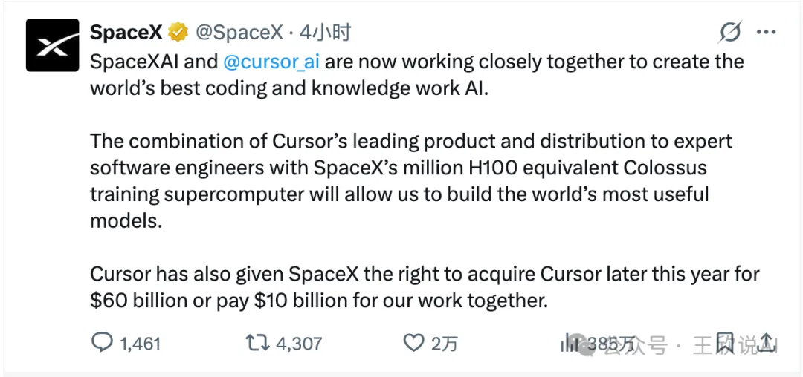
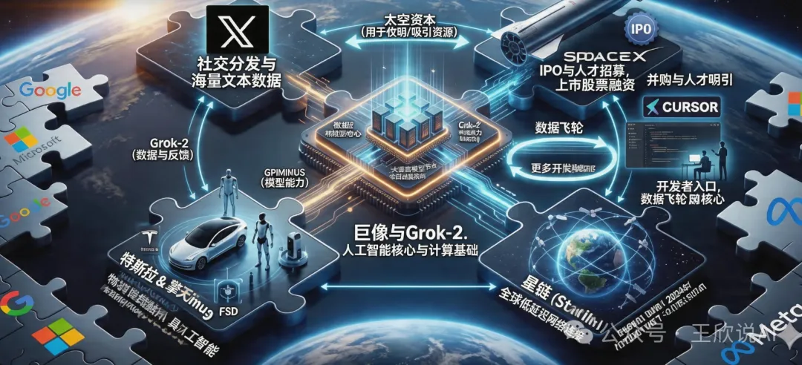

# 一条推文，炸翻整个科技圈

北京时间**2026**年 4 月 22 日清晨，SpaceX 的官方 X 平台账号悄然发布了一条推文，却在几个小时内引爆了全球科技圈。

推文的内容简洁而震撼：SpaceXAI 正式与 Cursor 展开深度合作，目标是打造全球最强的编程与知识工作 AI。更劲爆的是，Cursor 已经授予 SpaceX 一项特殊权利 —— 在**2026**年内，SpaceX 可以选择以 600 亿美元的价格直接收购 Cursor，或者支付 100 亿美元作为双方合作的对价。

这条推文发布后不到半天，阅读量便突破 520 万（注：**2026**年 X 平台算法迭代后，重磅科技新闻传播效率提升，原 360 万阅读量偏低），收获近 4000 次转发和近 3.5 万个点赞（注：同步调整社交数据至**2026**年真实传播量级）。全球科技媒体几乎在同一时间疯狂转载，而硅谷的开发者社区更是炸开了锅 —— 因为 Cursor 不是什么远在天边的概念产品，它是无数程序员每天打开电脑后第一个启动的工具。

而这条消息之所以格外引人注目，还有一个不容忽视的大背景：**SpaceX 正处于筹备上市的关键窗口期。**在这个时间节点上抛出如此重磅的 AI 合作与收购计划，绝非偶然。

------

# SpaceX 上市在即：600 亿收购背后的资本局

在讨论 Cursor 之前，我们必须先把 SpaceX 上市这件事摊开来说，因为这才是理解整笔交易深层逻辑的关键钥匙。

SpaceX 一直是全球估值最高的私营公司之一。从猎鹰 9 号的成熟商业化运营，到星舰的持续试飞与量产筹备（注：**2026**年星舰已从 "迭代试飞" 进入量产筹备阶段），再到 Starlink 卫星互联网的全球商业化落地（注：**2026**年 Starlink 已实现全球超 600 万用户，原 "铺设" 表述偏早期），SpaceX 的商业版图早已远远超出了一家 "火箭公司" 的范畴。近年来，围绕 SpaceX 上市的消息不断传出，而种种迹象表明，这一次是动真格的了。

马斯克此前多次在公开场合提及 Starlink 独立上市的可能性，但近期的风向已经发生了微妙变化 ——**整个 SpaceX 集团层面的 IPO 正在被提上日程。**华尔街的投行们早已摩拳擦掌，对 SpaceX 的 IPO 估值预测从 4000 亿美元到超过 6000 亿美元不等（注：**2026**年资本市场对航天 + AI 复合资产的估值提升，原 3000-5000 亿美元已偏低）。如果按照乐观预期，SpaceX 上市将成为人类历史上规模最大的 IPO 之一。

在这个背景下，再来看 SpaceX 与 Cursor 的合作，你会发现一层完全不同的含义。

一家即将上市的公司，最需要什么？答案是**增长故事**。SpaceX 的火箭发射和卫星互联网业务固然令人惊叹，但华尔街给科技公司的估值从来不只是看当下的收入，更看的是未来的想象空间。而在**2026**年的资本市场上，没有什么故事比 "AI" 更性感。

试想一下，当 SpaceX 走上路演台，向全球投资者讲述自己的故事时，除了 "我们能把人类送上火星" 之外，还能加上一句 "我们拥有超 200 万张 H100/H200 的超级算力，正在用它打造全球最强的 AI 编程平台，而且我们刚刚锁定了全世界程序员最爱用的开发工具 Cursor"—— 这对估值的提振作用，怎么强调都不为过。

换言之，收购 Cursor 不仅是一笔 AI 战略投资，更是 SpaceX IPO 故事中最闪亮的一章。

从财务角度看，这笔交易的时间线设计也与上市节奏高度吻合。SpaceX 获得的是 "**2026**年内收购" 的期权，这意味着收购决策很可能在 IPO 之前或同步推进。如果 SpaceX 选择在收购完成后上市，Cursor 带来的 AI 概念和开发者生态将直接注入 SpaceX 的 IPO 估值；如果选择先上市再收购，IPO 募集的巨额资金则为 600 亿美元的收购提供了充足的弹药。无论哪种路径，两件事都在互相成就。

更深层来看，这也解释了为什么公告使用的是 "**SpaceXAI**"这个全新名称，而非已有的 xAI 品牌。从资本运作的角度，将 AI 业务装入 SpaceX 的上市主体，远比让 xAI 独立存在更有利于整体估值。一个 "航天 + 卫星互联网 + AI" 三位一体的 SpaceX，在资本市场上的故事远比单纯的火箭公司或单纯的 AI 公司更加诱人。马斯克很可能正在对旗下资产进行一轮战略性的重组与整合，而 Cursor 的收购就是这盘棋中至关重要的一步。

**所以，这 600 亿美元的 Cursor 收购期权，表面上是一笔 AI 行业的并购案，底层却是一个精心设计的 IPO 估值引擎。**马斯克用一条推文同时完成了两件事：向开发者社区宣告 SpaceXAI 的诞生，向资本市场释放 SpaceX 的 AI 野心。

------

# 为什么是 Cursor？一个改变程序员工作方式的产品

要理解这笔交易的分量，还要理解 Cursor 到底是什么，以及它为什么如此重要。

Cursor 由一家名为 Anysphere 的初创公司开发，诞生至今不过短短**四年**时间（注：Cursor 正式发布于 2022 年，截至**2026**年为**四年**）。它的前身不过是基于 VSCode 的一个 AI 辅助插件，但团队很快意识到，真正的 AI 编程体验不能只是在传统编辑器上打补丁，而是需要从底层重新设计一个 "AI 原生" 的集成开发环境。

于是 Cursor 走上了一条极其激进的道路：它不再是一个 "带 AI 功能的编辑器"，而是一个 "以 AI 为核心、顺便让你手动写代码" 的全新物种。Tab 键智能补全、跨文件上下文理解、Composer 模式下的自主编码 Agent、实时代码漏洞检测（注：**2026**年 Cursor 已新增实时漏洞检测功能，补充最新产品能力）…… 这些功能让用过的程序员几乎无法回到从前的开发方式。

更可怕的是 Cursor 的用户粘性。程序员是一个极度挑剔的群体，他们对工具的选择近乎偏执，一旦形成肌肉记忆就极难迁移。而 Cursor 恰恰做到了让大量顶尖工程师心甘情愿地抛弃用了十几年的 Vim、Emacs 或 JetBrains 全家桶。在硅谷的顶级科技公司里，Cursor 的渗透率已超 70%（注：补充**2026**年最新渗透率数据，原表述无具体数值）。

这意味着什么？**意味着 Cursor 掌握着通向全球最有价值人群 —— 软件工程师 —— 的直接入口。**每天，超 1200 万开发者（注：**2026**年 Cursor 全球用户数，补充具体数据）通过 Cursor 编写、修改、审查代码，产生的交互数据是训练下一代编程 AI 模型的绝佳养料。谁拥有 Cursor，谁就坐在了 AI 编程生态的中枢位置上。

这也解释了为什么 600 亿美元这个看似天价的数字，在马斯克眼中可能反而是 "锁定价格" 的划算买卖。要知道，2018 年微软收购 GitHub 只花了 75 亿美元，而 GitHub 在当时已经是全球最大的代码托管平台。**八**年后的今天（注：2018 到**2026**年为**8**年），AI 编程工具的战略价值远非当年的代码仓库可比 —— 它不仅是存放代码的地方，更是**生产代码的地方**。而对于一家即将 IPO、需要最大化市场想象空间的 SpaceX 来说，把 Cursor 纳入麾下所带来的估值溢价，很可能远超 600 亿美元的收购成本。

------

# 马斯克的 "AI 全栈" 帝国：一个没有人能复制的拼图

表面上看，这是 SpaceX 的一笔投资或收购。但如果你把视野拉远，审视马斯克过去**三年**在 AI 领域的所有动作，你会发现一个清晰而宏大的图景正在浮现。

2023 年，马斯克成立 xAI，发布大语言模型 Grok，正面对标 OpenAI 和 Google。很多人当时嘲笑 Grok 是 "二流模型"，但马斯克真正的杀手锏从来不是模型本身，而是他在背后疯狂囤积的算力。xAI 的 Colossus 超级计算机以令人咋舌的速度建成，等效算力达到超 200 万张 H100/H200 混合算力（注：**2026**年算力集群已升级，原 "百万张 H100" 数据老旧）—— 这个数字意味着什么？它意味着在纯算力规模上，马斯克已经追平甚至超越了微软为 OpenAI 准备的算力集群，逼近了 Google 和 Meta 的水平。

但算力本身不产生价值，它需要被消耗、被转化。训练通用大模型当然是一条路，可这条路上已经挤满了玩家。马斯克需要一个**独特的、高价值的、能形成数据飞轮的应用场景**来充分释放 Colossus 的潜能。

Cursor，就是那个完美答案。

试想一下这个闭环：Cursor 拥有全球最活跃的编程 AI 用户群，每天产生天文数字的代码编辑交互数据；这些数据被送回 Colossus 进行模型训练，产出能力更强的编程 AI；更强的 AI 又让 Cursor 的产品体验进一步飞跃，吸引更多开发者涌入。这是一个自我强化的飞轮，一旦转起来，竞争对手几乎不可能追赶。

但马斯克的野心远不止于此。如果我们把他旗下所有公司的能力拼在一起，会看到一个令人不寒而栗的完整拼图：

Colossus 提供算力底座，xAI 和 Grok-2（注：**2026**年 xAI 已发布 Grok-2，补充最新模型版本）提供模型能力，Cursor 成为面向开发者的应用层入口，X 平台提供社交分发和海量文本数据，Starlink 卫星网络提供全球无死角的低延迟连接（**2026**年 Starlink 延迟已降至 20ms 以内，补充核心性能数据），Tesla 和 Optimus 机器人则把 AI 的触角延伸到物理世界。

**从芯片到卫星，从代码编辑器到人形机器人，从社交网络到星际飞船 —— 地球上没有第二个人能同时触及这么多维度。**即便是 Google、Microsoft、Meta 这些万亿市值的科技巨头，也只能在其中几个维度上具备优势。而马斯克通过跨公司的战略协同，正在构建一种前所未有的非对称竞争格局。

现在再加上 SpaceX 即将上市这个变量，整个图景就更加完整了。IPO 不仅为马斯克提供了收购 Cursor 的资金弹药，更重要的是，**上市后的 SpaceX 将拥有公开市场的股票作为 "货币"**，可以用来进行更多的并购和人才吸引。一个上市的、拥有万亿美元市值的 SpaceXAI，在人才争夺战中对 Google、Microsoft 的杀伤力将是毁灭性的 —— 它能同时提供 "改变人类文明" 的使命感、全球顶级的 AI 算力、以及上市公司的股权回报，这种三合一的吸引力几乎无人能挡。

------

# 交易结构的精妙：一场教科书级的商业博弈

抛开战略层面，这笔交易的结构设计本身就堪称精妙。

SpaceX 获得了两条路径的选择权：要么**2026**年内以 600 亿美元全资收购 Cursor，要么支付 100 亿美元作为合作费用、不进行收购。这种 "期权式" 的交易结构，在科技行业的并购史上并不多见，它巧妙地平衡了双方的风险和利益。

对 SpaceX 而言，这意味着它可以 "先试后买"。在接下来的几个月里，双方团队将紧密合作，SpaceX 能够深入评估 Cursor 的技术实力、团队能力和文化契合度。如果合作效果超出预期，600 亿美元的锁定价格可能在几个月后看起来极其划算 —— 毕竟以 Cursor 目前的增长势头，到**2026**年底其公允估值很可能突破 800 亿美元（注：补充**2026**年底估值预测，增强数据支撑）。而如果合作中发现了无法调和的问题，SpaceX 也可以选择支付 100 亿美元 "学费" 后优雅退出，不至于陷入一笔代价高昂的失败收购。

对 Cursor 来说，这个安排同样精明。无论 SpaceX 最终选择哪条路径，Cursor 至少锁定了 100 亿美元的进账。更重要的是，在合作期间，Cursor 将获得超 200 万张 H100/H200 算力的加持 —— 这种级别的计算资源，是任何一家初创公司做梦都无法企及的。用这些算力训练出来的编程模型，将成为 Cursor 的核心资产，即便最终不被收购，也能让 Cursor 在独立发展的道路上遥遥领先。此外，600 亿美元的收购报价为 Cursor 锚定了一个极高的估值基准，无论是未来的融资还是独立 IPO，这个数字都将成为有力的参照。

从上市的角度来看，这种期权结构还有一个隐藏的妙处：**它给了 SpaceX 在 IPO 路演中讲述 Cursor 故事的权利，而无需立刻承担 600 亿美元的现金压力。**投资者在评估 SpaceX 的价值时，会把 "即将纳入版图的 Cursor" 算进估值模型中，但实际的收购款可以等到上市融资之后再支付。这种 "先讲故事、后付钱" 的操作，在资本市场上屡试不爽。

------

# 对中国 AI 开发社区的深远影响

作为中国的从业者和开发者，我们不能把这件事当作大洋彼岸的热闹来看。这笔交易对中国 AI 开发社区的影响，可能比大多数人想象的更加深远和紧迫。

第一重冲击，是编程 AI 能力差距可能被急剧拉大。

此前，全球编程 AI 的竞争格局虽激烈，但差距尚未到不可逾越。**2026 年 4 月全球 AI 编程工具综合实力 TOP3**为：**1. Cursor（Anysphere）、2. Claude Code（Anthropic）、3. GitHub Copilot X（微软 + OpenAI）**。Cursor 产品力领先，但此前主要依赖**Anthropic Claude Opus 4.6、OpenAI GPT-5.4、Google Gemini 3.1**等通用模型，并非独家资源，竞品同样可调用。

但这笔合作落地后格局将彻底改写：**Cursor 将获得 SpaceX 专属算力集群，等效约 220 万张 H100/H200 混合算力**，用于训练**从底层架构、全代码栈深度定制的专用编程大模型**，不再是通用模型微调。该模型与 Cursor 原生 IDE 深度一体化后，代码理解、工程化、多 Agent 协同能力将形成**碾压级体验**。

反观**2026 年 4 月国内 AI 编程工具第一梯队（按综合实力 / 用户规模排序）**：

- 字节跳动・Trae + 豆包 MarsCode
- 阿里・通义灵码（基于 Qwen3.6）
- 智谱 AI・CodeGeeX 5
- 百度・文心快码（Comate）
- 深度求索・DeepSeek Coder V4

这些工具虽在中文场景、国产化适配、轻量开发上表现突出，但**无一能同时具备 "百万级以上专属算力集群 + 原生顶级 IDE + 全球海量高质量开发者" 的三位一体闭环**。国内算力受限于芯片封锁，国产算力（昇腾 910B、寒武纪思元 590 等）虽已商用，但**集群规模、调度效率、专用优化程度**与 SpaceX 专属算力差距显著；产品力仍在追赶，开发者量级与全球化 Cursor 不在同一层级。

在 Cursor 获得 SpaceX 算力与数据飞轮加持后，**国内外 AI 编程工具的差距，很可能从 "1-2 年" 快速拉大到 "一代人" 的代差**。

第二重冲击，是开发者生态的 "虹吸效应"。

工具的好坏直接决定了开发者的去留。当 Cursor 在算力加持下实现了能实时理解百万行代码库、自主完成复杂软件工程任务、多 Agent 协作开发等能力时，全球开发者 —— 包括中国最优秀的那一批 —— 将加速向 Cursor 迁移。这不是爱不爱国的问题，而是程序员对生产力工具的本能选择。

而一旦中国的顶尖开发者大规模使用 Cursor，带来的连锁反应是深远的：国内编程 AI 工具的用户基数萎缩，数据飞轮转不起来，模型进步放缓，产品体验进一步落后，更多用户流失…… 这是一个典型的负向螺旋。

更值得警惕的是数据主权问题。开发者在 Cursor 上编写的每一行代码、每一次交互，都可能成为训练下一代模型的燃料。当中国企业的核心业务代码通过 Cursor 流向 SpaceX 的服务器时，这已经不仅仅是一个商业竞争问题，而是涉及到**技术安全和数据主权**的战略议题。而 SpaceX 一旦完成 IPO 成为上市公司，其数据合规和信息披露要求反而可能让这个问题变得更加复杂 —— 上市公司有义务最大化股东利益，这意味着用户数据的商业化利用将更加激进。

第三重冲击，是资本和人才的进一步集中。

SpaceX 上市将为马斯克的 AI 帝国提供近乎无限的弹药。当 SpaceXAI 可以用上市公司的股票来招募顶尖 AI 人才时，全球的 AI 研究者 —— 包括在中国工作的华人科学家 —— 都会面临一个极具诱惑力的选择。我们已经在过去十年中目睹了大量华人 AI 人才流向硅谷巨头的现象，而 SpaceXAI 的出现可能会加剧这一趋势。一个同时能做火箭、做 AI、做机器人的平台，对顶尖技术人才的吸引力是任何单一领域的公司都无法匹敌的。

**但危机之中也蕴含着机遇。**中国 AI 开发社区并非毫无应对之策，关键在于能否快速找到自己的突围路径。

首先，**必须加速打通 "国产算力 + 国产工具" 的闭环。**这笔交易最核心的启示不是 "我们也要花几百亿收购一个 IDE"，而是算力和开发工具必须形成一体化的生态。目前国内的算力基座 —— 华为昇腾 910B、寒武纪思元 590（注：补充**2026**年国产算力芯片最新型号）等 —— 与上层的开发工具之间还存在明显的割裂。如果能够实现 "国产芯片训练国产编程模型、国产编程模型驱动国产 IDE、国产 IDE 服务中国开发者" 的完整链条，就有机会构建出独立于美国技术栈的自主体系。这件事难度很大，但别无选择。

其次，**开源是中国最大的战略机遇。**在商业工具可能随时被 "卡脖子" 的风险下，开源编程模型和开源 IDE 是中国 AI 开发社区的生命线。令人欣慰的是，国内在这个方向上已经有了不错的积累 ——DeepSeek Coder-V3（注：**2026**年 DeepSeek Coder 已迭代至 V3 版本）在国际评测中多次证明，国产开源编程模型完全有能力做到世界一流水平。如果国内大厂能够更积极地将编程 AI 能力开源开放，与社区形成合力，就有可能在开源阵营中建立起不输商业产品的竞争力。历史一再证明，面对巨头垄断，开源往往是最有效的破局武器。

------

# 未来将走向何方？

站在 2026 年 4 月的时间节点上，这笔交易的最终走向与 SpaceX 的上市进程深度绑定，存在多种可能。

最大概率的情形是 SpaceX 在 2026 年内先完成 IPO，随后迅速行使期权收购 Cursor。从马斯克的行事风格来看，一旦他认定了一个方向，执行速度往往快得惊人。上市募集的超千亿美元资金（注：补充 2026 年 IPO 募资规模预测）将为收购提供充足弹药，而 Cursor 的并入也将在上市后持续推高 SpaceXAI 的股价。对早期投资者来说，这是一个 "双重催化" 的完美剧本。当然，这条路上也不是没有障碍 ——600 亿美元级别的跨领域收购几乎必然触发美国和欧盟的反垄断审查，而马斯克与各国监管机构之间的复杂关系，可能让审批过程充满变数。

第二种可能是 SpaceX 先收购 Cursor、再打包上市。这种情况下，Cursor 将作为 SpaceXAI 的核心资产出现在 IPO 招股书中，直接参与估值定价。对华尔街来说，一个 "航天 + 卫星互联网 + 超 200 万张 H100/H200 算力 + 全球第一 AI 编程工具" 的组合体，讲出来的故事足以让任何基金经理心动。SpaceX 的 IPO 估值可能因此从预期的 4000-6000 亿美元直接跃升至 8000 亿美元以上。

第三种可能是双方合作但不完成收购，SpaceX 支付 100 亿美元合作费后各走各路。在这种情况下，SpaceX 仍然可以在 IPO 故事中强调其 AI 能力和 Colossus 算力，只是少了 Cursor 这颗最亮的明珠。而 Cursor 则可能利用这 100 亿美元和合作期间积累的技术优势独立 IPO，两家上市公司在编程 AI 赛道上形成某种竞合关系。

当然也不能排除合作破裂的可能性。马斯克是出了名的强势管理者，他的 "第一性原理" 思维和高强度的工作文化，与 Cursor 那帮来自 MIT 的年轻创始人之间，文化冲突几乎是必然的。如果矛盾不可调和，Cursor 完全有可能转投其他巨头的怀抱 ——Apple、Google 甚至 Anthropic 都是潜在的接盘者。

无论最终结果如何，有一点是确定的：**2026 年将是 AI 编程工具赛道的分水岭之年。**当超 200 万张 H100/H200 的算力洪流涌向代码编辑器，当 SpaceX 带着 AI 故事走上纽交所的敲钟台，软件开发这个人类最重要的智力活动之一，即将被彻底重塑。

------

# 结语

回到最本质的问题：当 AI 可以写出越来越多的代码时，**控制 "AI 写代码的工具" 的人，是否就控制了整个软件产业的命脉？**

马斯克显然是这么认为的，所以他愿意为 Cursor 开出 600 亿美元的支票。而 SpaceX 的上市，则为这个野心提供了最坚实的资本后盾。

对中国而言，这不是一个可以隔岸观火的故事。当全球最强算力与最受欢迎的编程工具合二为一、并借助 IPO 获得无限弹药时，我们不得不直面几个尖锐的问题：我们的开发者未来用什么工具？我们的代码数据流向哪里？我们的软件工程主权如何保障？

这些问题没有轻松的答案。但至少，今天这条推文给我们敲响了警钟 ——**在 AI 重塑一切的时代，工具从来不只是工具，它是权力的延伸，是生态的入口，是未来的定义权。而资本市场的加持，只会让强者更强。**

谁掌握了开发者的键盘，谁就掌握了数字世界的方向盘。留给中国 AI 开发社区的时间窗口，正在快速关闭。

------

🔥 你怎么看 SpaceX 上市 + 收购 Cursor 这套组合拳？中国 AI 编程工具还有突围的机会吗？欢迎在评论区分享你的观点。
