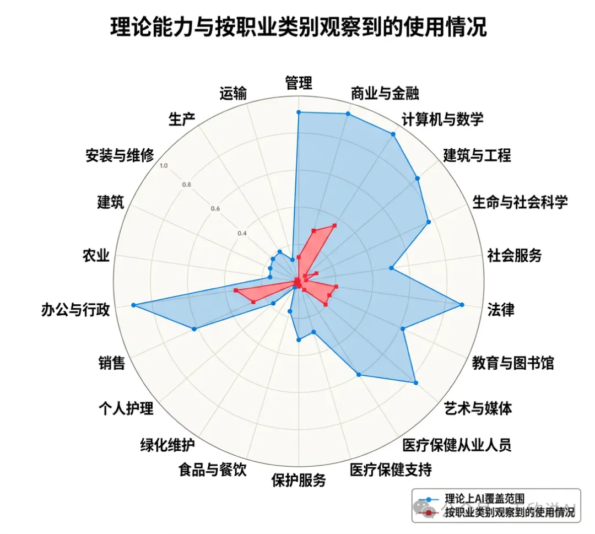
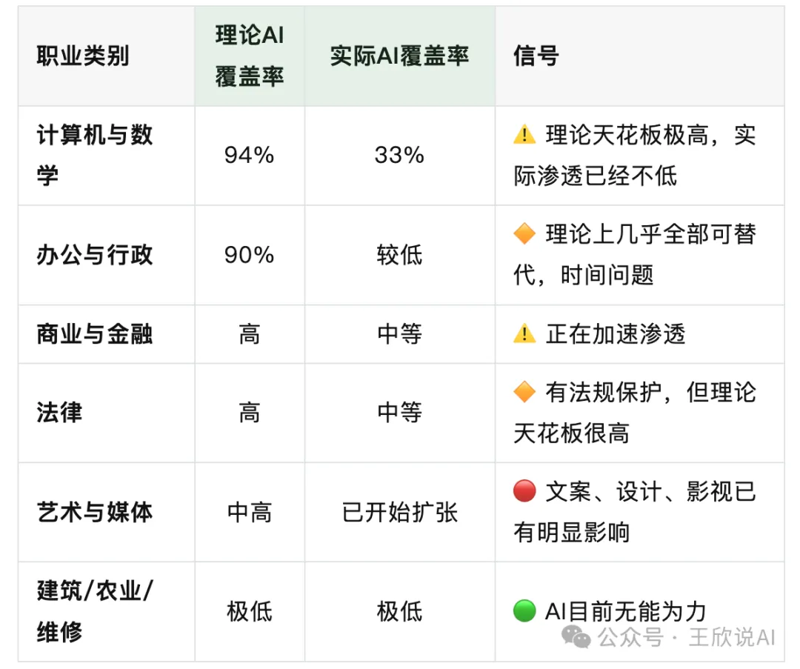
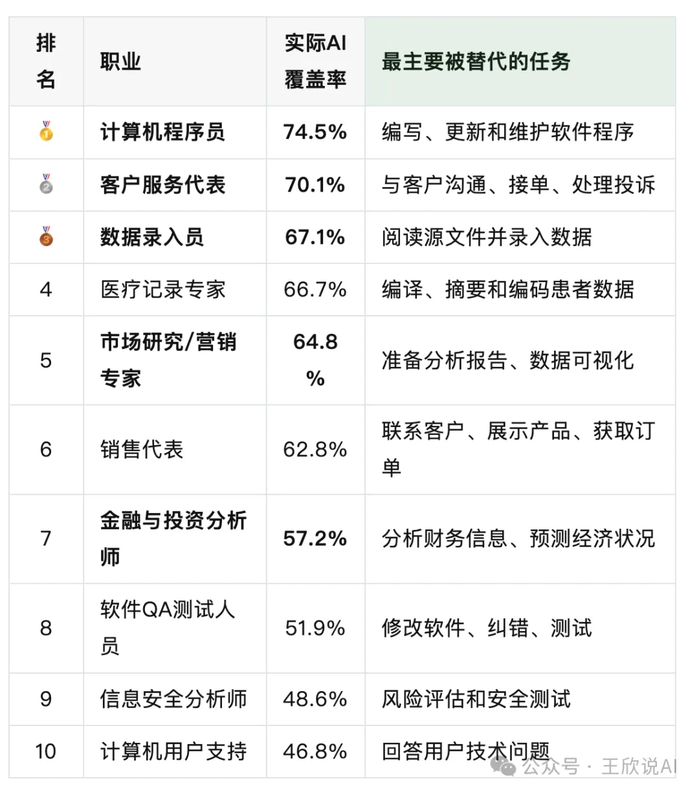
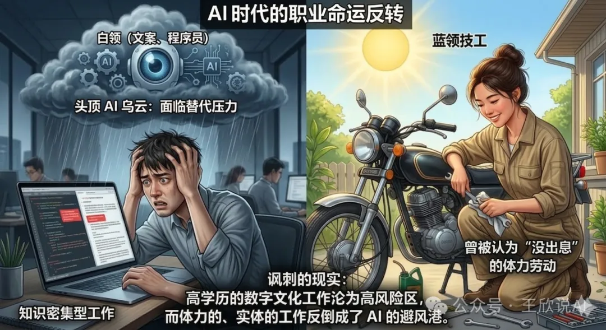
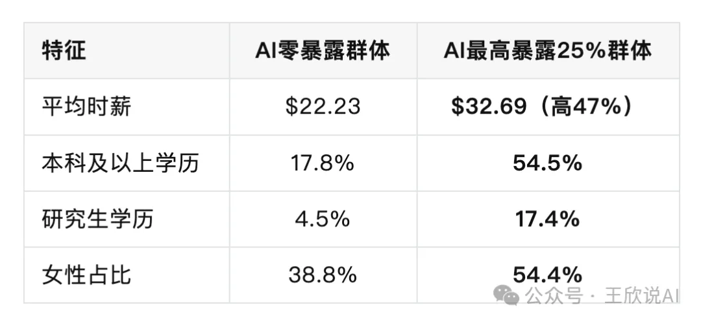

今天这篇文章，我建议你收藏后认真读完。

因为这次说话的，不是媒体，不是自媒体博主，不是贩卖焦虑的营销号

而是造出AI的人，亲自告诉你：谁正在被替代。

------

# 01｜造AI的公司，发布了一份让人沉默的报告

2026年3月5日，Claude的开发公司**Anthropic**发布了一份重磅研究报告：

> 《AI对劳动力市场的影响：一种新的衡量标准与早期证据》
>
> *Labor market impacts of AI: A new measure and early evidence*

📎 官方地址：https://www.anthropic.com/research/labor-market-impacts

这份报告的特殊之处在于——**它不是基于理论猜测，而是基于数百万次真实的AI使用数据。**

过去所有关于"AI会取代谁"的讨论，都停留在**"理论上AI能做什么"**这个层面。

而Anthropic这次干了一件前所未有的事：

> **它用自家产品Claude的真实使用数据，去对照每个职业的每一项具体任务，看AI到底在实际工作中覆盖了多少。**

用大白话说就是：

不是"AI能不能干你的活"，而是"AI已经在干你的多少活了"。

这个区别，非常关键。

------

# 02｜一张图，让你看清残酷现实

报告里最核心的一张图，就是这张雷达图👇

> 🔵 **蓝色 = 理论上AI能覆盖的任务范围**（AI的"理论天花板"）
>
> 🔴 **红色 = 实际上人们已经在用AI做的事**（AI的"当前水位"）

看懂这张图，你就看懂了AI对就业的真实威胁。

先说一个让人稍微松口气的事实：

> **红色远远小于蓝色——AI的实际应用，目前只覆盖了理论能力的一小部分。**

也就是说，**AI还远没到"全面替代"的程度。**

但别急着放松，因为真正让人后背发凉的是——

红色正在逼近蓝色。而且在某些领域，红色已经填了很大一块。

具体来看几个关键行业：

翻译成人话：

如果你是程序员、文案、设计师、客服、金融分析师、市场营销——**蓝色的"理论天花板"就像悬在头顶的巨石**，红色的"实际水位"正在一点点逼近。

如果你是水电工、建筑工人、护理人员、农民——**目前这块石头还没有挂到你头上。**

------

# 03｜最扎心的数据：AI暴露度最高的十大职业

报告直接列出了**目前AI实际覆盖率最高的十大职业**：

程序员，74.5%。

这意味着一个程序员日常工作中，**有四分之三的任务，已经有人在用AI完成了。**

不是"理论上能做"，是"实际上已经有人在这么做了"。

客服代表70.1%——你打过AI客服电话吗？那就是这个数字的注脚。

营销专家64.8%——生成报告、分析数据、写文案，这些都是AI的舒适区。

**而在另一端，30%的劳动者AI覆盖率为零。**他们是谁？厨师、摩托车修理工、救生员、调酒师、洗碗工。

讽刺吗？当年被认为"没出息"的体力劳动，现在反而成了AI的安全区。

> *注：这是趋势观察，并非绝对结论，核心是提醒我们要提升不可被 AI 替代的核心能力。*

------

# 04｜比"被裁"更可怕的事：入口正在关闭

很多人可能会问：**既然覆盖率这么高，为什么没看到大规模裁员？**

报告也研究了这个问题，结论是：

> **高AI暴露职业的失业率，目前确实没有显著上升。**

但报告同时发现了一个**更隐蔽、更可怕的信号**——

> **22-25岁年轻人进入高风险职业的招聘速度，正在明显放缓。**

企业没有在裁老员工，但**正在减少招新人**。

ChatGPT发布后，年轻人进入高暴露职业的就业率**下降了约14%**。

这意味着什么？

AI不是拿着刀冲进办公室赶人走，而是悄悄把门关小了。

还在里面的人暂时安全，但正准备进去的人——**发现门越来越窄。**

如果你是正在找工作的应届生，如果你的孩子正在选专业——**这个数据比任何裁员新闻都更值得警惕。**

------

# 05｜最反直觉的发现：AI冲击的是"高学历高薪"群体

报告还做了一个残酷的对比：

看到了吗？

被AI冲击最大的群体，不是蓝领，不是低学历工人，而是——

> **受过良好教育、薪资较高、以信息处理为核心工作的白领专业人士。**

学历越高，越可能从事的是文字处理、数据分析、逻辑推理这类工作——**而这恰恰是大语言模型最擅长的事。**

这彻底打破了一个延续了几十年的信念：

> "好好读书→考好大学→学热门专业→进大公司做白领→人生稳了。"

这条路，**正在被AI重新定义。**

------

# 06｜那我们怎么办？给所有人的五条真诚建议

基于这份报告的数据，我给出以下建议。**不贩卖焦虑，只说实话：**

🔴 给正在选专业的高中生和家长

不要只看"热门"和"高薪"，要看这个专业的核心技能是否容易被AI标准化。

"纯信息搬运型"专业（基础编程、初级会计、数据录入类）→**风险最高**

"需要物理在场"的专业（临床医学、护理、工程施工、农学）→**暂时安全**

"创意+判断+人际"的复合型方向 →**最值得押注**

一个简单的判断标准：如果一个工作可以完全在电脑前完成、且输入输出都是文字或数据——它被AI替代的优先级就很高。

🔴 给在校大学生

不管你学什么专业，现在就开始学习使用AI工具，把它变成你的"超能力"。

报告有一个关键发现：**软件开发人员的AI暴露度高达30%，但BLS预测这个职业未来十年仍将增长16%。**

这说明什么？

> **AI替代的是"任务"，不一定是"岗位"。能驾驭AI的人，反而更值钱。**

🔴 给已经在职场的文案/程序员/设计师/营销人

不要恐惧，但要清醒。

你的竞争对手不是AI，而是**会用AI的同行**。

当你的同事用AI一天写完你一周的方案时，差距就出来了。**主动拥抱工具，把效率提上去，把创意和判断力留给自己。**

🔴 给影视/艺术从业者

报告显示"艺术与媒体"的实际AI覆盖已经在扩张。AI能写脚本、做分镜、生成概念图、甚至做粗剪。

但AI**做不到**的是：讲一个打动人心的故事、理解人类的情感共鸣、做出有灵魂的审美判断。

**技术壁垒在消失，审美壁垒在升高。**把时间花在提升品味和叙事能力上，而不是死守软件操作。

🔴 给所有人

这份报告最重要的一句话是：

> **"AI远未达到其理论能力——实际覆盖率仍仅为可行范围的一小部分。"**

我们还有时间。但窗口正在收窄。

AI的影响不是海啸，而是涨潮。不会一下把你淹没，但如果你一直站在原地——**等你发现水到脚踝的时候，退路已经不多了。**

