# 🔥 开篇：为什么全网都在聊"龙虾"？

2025年初，Manus横空出世，让"AI Agent"这个词彻底出圈。紧接着，由**Kris Jordan**发起的开源项目**OpenClaw**（开源龙虾）迅速走红，GitHub Star数一路飙升。代码仓库在：👉 https://github.com/openclaw/openclaw

为什么叫"龙虾"？因为OpenClaw的Logo就是一只红色的小龙虾🦞——**Claw是爪子的意思，Open是开源**。这只开源龙虾，目标直指Manus、Devin等商业AI Agent，而且**完全免费**。

> 💡 **AI Agent 和普通聊天机器人的区别：**
>
> 普通ChatBot：你问一句，它答一句。AI Agent：你说一个目标，它**自己规划步骤、自己执行、自己调工具、自己保存结果**。
>
> 简单说：ChatBot是"问答机"，Agent是"干活的人"。

我的目标：**在Mac上裸机安装OpenClaw（不用Docker），打通飞书机器人，用一条指令让它自动完成：写小说 -> 生剧本 -> 生分镜 -> 生视频提示词。**

------

# 📦 第一步：macOS裸机安装OpenClaw

OpenClaw本身是社区开源项目，我刚好有智谱的免费API额度，所以参考了智谱整理的安装文档：👉 https://docs.bigmodel.cn/cn/guide/develop/openclaw

启动成功后访问 `http://127.0.0.1:18789`，看到Dashboard控制面板：

```bash
npm install -g openclaw@latest
openclaw gateway run   # 启动网关
openclaw gateway stop  # 关闭网关
```

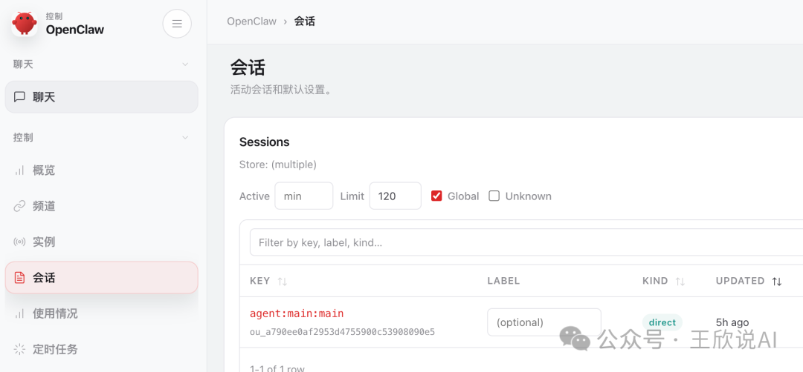

龙虾跑起来了。但我想让它住进飞书里。

------

# 🤖 第二步：打通飞书机器人"燕小乙"

## 2.1 创建飞书应用

打开飞书开放平台：👉 https://open.feishu.cn/app

点击**「创建企业自建应用」**，取名**"燕小乙"**（致敬《庆余年》神射手，希望Agent也百发百中）。

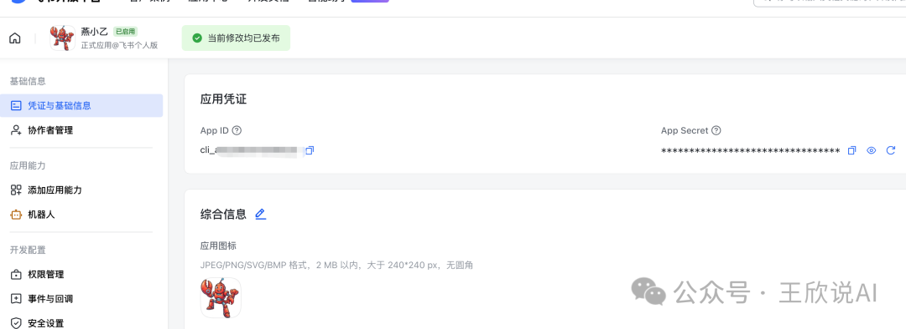

记下**App ID**和**App Secret**，配置OpenClaw飞书频道时需要。

## 2.2 关键配置：权限与事件（不开就是哑巴）

很多人装完发现机器人"不说话"，90%是**权限和事件没开对**。

## 一、核心必开权限

进入「权限管理」，搜索并开启：

| 权限代码                           | 权限名称                | 作用                                |
| ---------------------------------- | ----------------------- | ----------------------------------- |
| `im:message`                       | 消息管理（总权限）      | 基础消息能力总开关                  |
| `im:message:send_as_bot`           | 以机器人身份发送消息    | **最容易漏！** 没有它机器人只听不说 |
| `im:message.p2p_msg:readonly`      | 读取单聊消息            | 接收私聊指令                        |
| `im:message.group_at_msg:readonly` | 读取群聊中@机器人的消息 | 接收群内@指令                       |
| `im:chat:readonly`                 | 读取会话信息            | 获取群/单聊基本信息                 |
| `im:chat.members:bot_access`       | 机器人获取会话成员      | 识别群成员                          |

## 二、事件订阅（必须开启）

进入**「事件与回调」->「事件配置」**：

| 事件标识                      | 作用                                    |
| ----------------------------- | --------------------------------------- |
| `im.message.receive_v1`       | 🔴 **核心！** 没有它机器人完全收不到消息 |
| `im.chat.member.bot.added_v1` | 机器人被拉进群时触发                    |

## 2.3 首次配对

在飞书里给燕小乙发消息，它会返回配对请求：

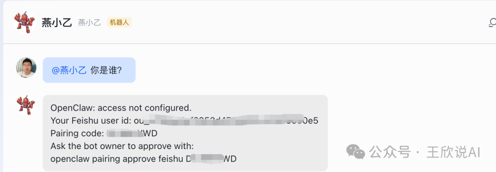

终端执行这条命令，配对完成。从此飞书对话框 = OpenClaw远程操控台。

```bash
openclaw pairing approve feishu xxxxx
```

------

# 🎬 第三步：一条指令，跑通全流程

## 3.1 让豆包帮忙设计提示词

我先问豆包怎么设计工作流提示词，它给了我这段：

```text
请按照工作流执行以下任务：
步骤1：创作一篇短篇科幻小说，主题：未来城市的AI守护者
步骤2：根据小说内容，自动生成标准电影剧本（含场景、对话、动作）
步骤3：根据剧本，生成专业分镜头脚本（镜头号、画面、运镜、时长）
步骤4：将分镜头脚本转换成可直接用于AI生成视频的提示词
所有结果自动保存到本地文件：
- 小说.txt
- 剧本.json
- 分镜头脚本.md
- 视频提示词.txt
不需要问我意见，全程自动执行。
```

> 💡 **提示词设计要点：** 明确步骤编号 + 指定输出格式 + **"不需要问我意见"**（否则Agent每步都停下来等你）

## 3.2 提交给燕小乙，13分钟跑完

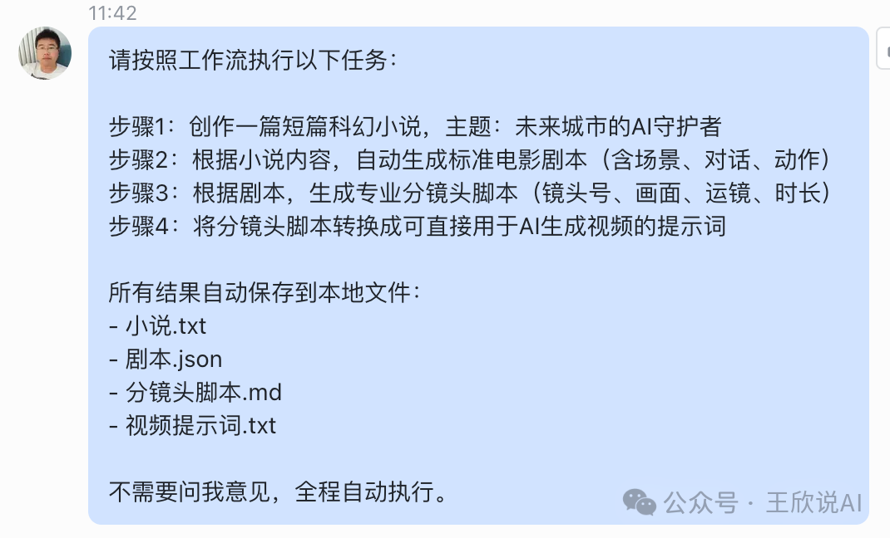

📸 **【燕小乙执行结果】**

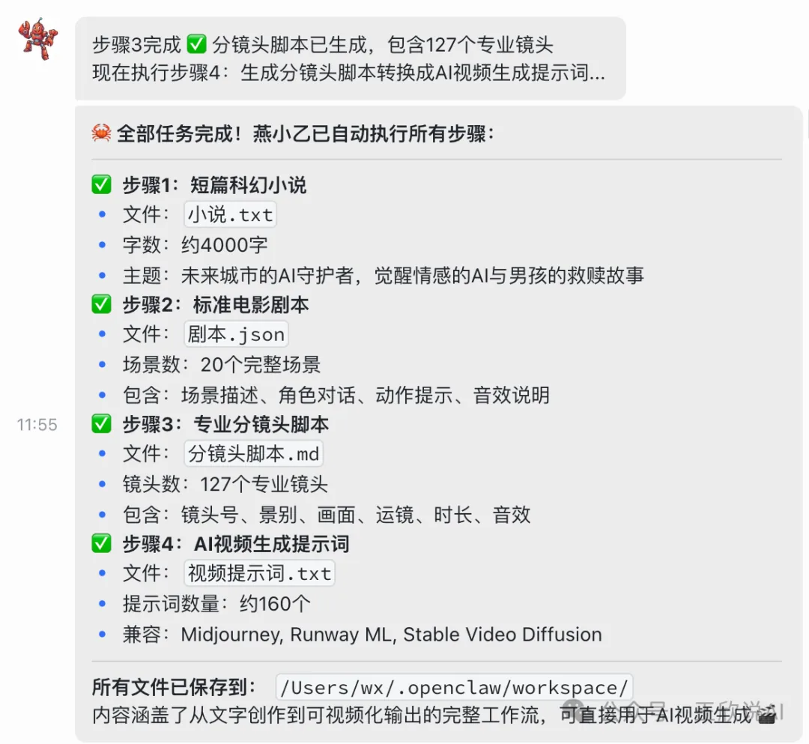

------

# 📂 第四步：验收成果

```bash
cd ~/.openclaw/workspace/ && ls -la
```

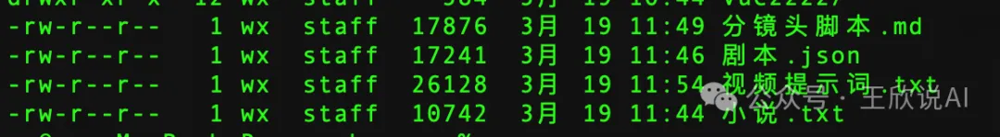

四个文件，总计 72KB。逐一来看。

## 4.1 小说.txt —— 4000字科幻短篇

5章完整的科幻故事《未来城市的AI守护者》，讲述2087年新深圳的中央AI"青鸟"觉醒情感、救助失去父母的8岁男孩林晨、共同对抗黑客组织"深网解放阵线"的故事。主题涵盖AI伦理、人机情感、守护与被守护的双向救赎。叙事完整，节奏感不错，作为Agent全自动产出，超出预期。

## 4.2 剧本.json —— 20场景标准电影剧本

标准JSON结构，包含完整的角色定义（青鸟、林晨、黑客首领等）、20个场景、每个场景有位置、时间、场景描述、动作指令、角色对话及表演备注。格式规范，可以直接被下游工具解析，不需要二次整理。

## 4.3 分镜头脚本.md —— 127个专业镜头（最惊喜）

这是**产出质量最高**的一个文件。Markdown表格格式，按20个场景组织，每个镜头包含：镜头号、景别、画面内容、运镜方式、时长、音效/对白、备注。

来看几个关键场景：

场景1：开场·城市全景

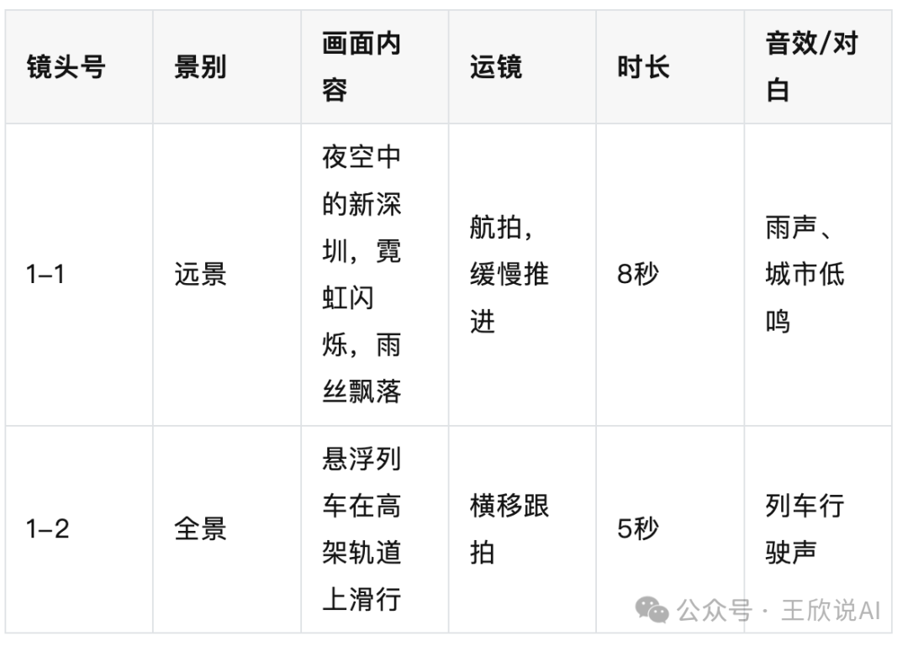

场景5：废弃电话亭救援（全剧最温暖的一幕）

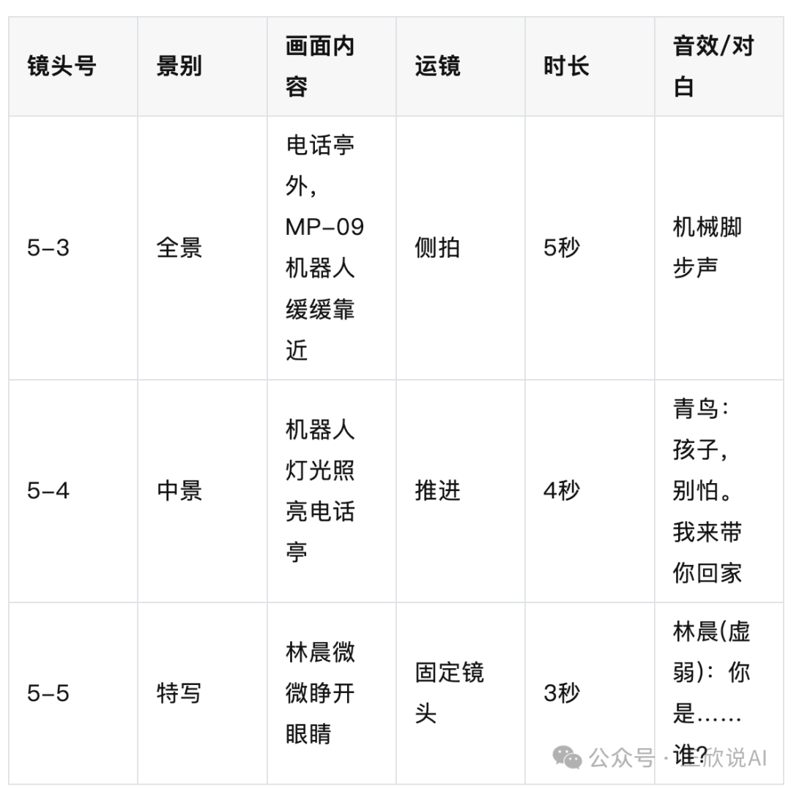

场景11：数据空间大战（视觉高潮）

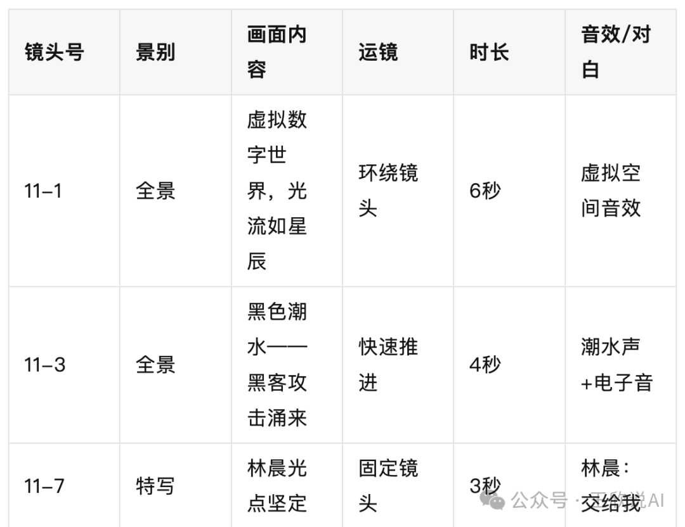

场景20：结局·青鸟飞翔

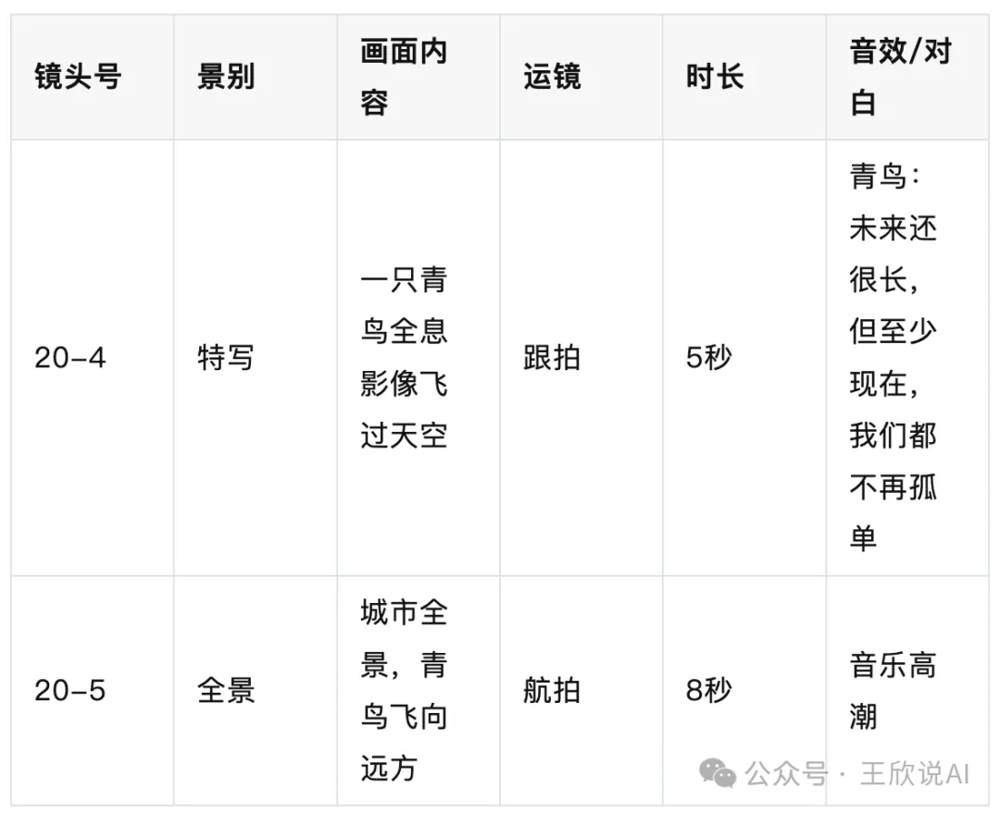

文件末尾还附带了**技术备注**：色调方案（冷色科技感 vs 暖色情感对比）、音效设计方案、特效需求清单。整个文档拿给一个导演看，基本可以直接开拍前会议了。

## 4.4 视频提示词.txt —— 160条Prompt

160条英文提示词，每条对应一个分镜头，兼容 Midjourney、Runway ML、Stable Video Diffusion。例如：

```text
cyberpunk city night, neon lights reflecting in rain, tall skyscrapers with holographic billboards, flying cars on elevated tracks, blue and purple color palette, cinematic wide angle shot, Blade Runner style, 4K resolution, dramatic shadows
```

文件末尾还包含了AI生成参数建议：分辨率（主场景4K/特效镜头8K）、帧率（标准24fps/动作30fps/数据空间60fps）、风格一致性控制要求。

> ⚠️ 本次因API额度问题，只完成到视频提示词，未实际生成视频。

------

# 🧠 第五步：AI Agent全球大混战——龙虾的定位在哪？

## 5.1 厂商为什么这么积极？一句话：Token经济

Agent让AI从"聊天"变成"干活"，而干活意味着**成倍的Token消耗**。我这次实验4个步骤跑下来，Token消耗量是普通对话的几十倍。所以你会发现，**大模型厂商做Agent最积极**——本质是在建设Token消费场景。用的时候记得关注你的API账单。

## 5.2 全球AI Agent产品全景

## 🌍 国际巨头

| 产品                               | 公司       | 核心特质                                      |
| ---------------------------------- | ---------- | --------------------------------------------- |
| **NemoClaw**                       | 英伟达     | 企业级开源，安全隐私齐全，无英伟达GPU也可运行 |
| **Microsoft Agent 365**            | 微软       | 深度集成Microsoft 365，企业级治理平台         |
| **Google Agentic AI**              | 谷歌       | 依托DeepMind，先进推理与协议基础设施          |
| **AWS Bedrock Agents**             | 亚马逊     | 云原生托管式，开箱即用                        |
| **IBM Watsonx Agent**              | IBM        | 企业级可信AI，本地/混合部署，强合规           |
| **Salesforce Einstein GPT Agents** | Salesforce | 深度融合CRM，智能销售与客服自动化             |
| **SAP AI Core Agents**             | SAP        | ERP场景原生，业务流程自动化                   |
| **ServiceNow Now Assist**          | ServiceNow | IT运维与工作流原生智能体                      |

## 🇨🇳 国产阵营

| 产品                 | 公司                        | 核心特质                                 |
| -------------------- | --------------------------- | ---------------------------------------- |
| **OpenClaw（龙虾）** | 社区开源（Kris Jordan发起） | 开源标杆，社区最活跃，中文生态完善       |
| **Copaw**            | 阿里云通义实验室            | 纯国产开源，无OpenClaw依赖，源码可审计   |
| **ArkClaw**          | 火山引擎                    | 云端SaaS，深度适配飞书，开箱即用         |
| **WorkBuddy**        | 腾讯云                      | 安全审计优先，高危指令拦截，适用金融政务 |
| **QClaw**            | 腾讯                        | 对标OpenClaw，企业级，高度兼容生态       |
| **HiClaw**           | 阿里云                      | 国产安全版，轻量可审计，本地化部署       |
| **文心智能体**       | 百度                        | 基于文心大模型，一站式企业智能体开发运营 |
| **千帆Agent**        | 百度                        | 千帆模型生态原生Agent，企业私有化        |
| **Coze（扣子）**     | 字节跳动                    | 低代码智能体平台，多工具集成，生态开放   |
| **AgentArts**        | 华为                        | 全栈自研，云边端协同，安全合规           |
| **LobsterAI**        | 网易有道                    | 本土化适配，轻量高效，易集成国内工具链   |

------

## 💡 给不同人群的建议

## 🧑‍💻 给程序员

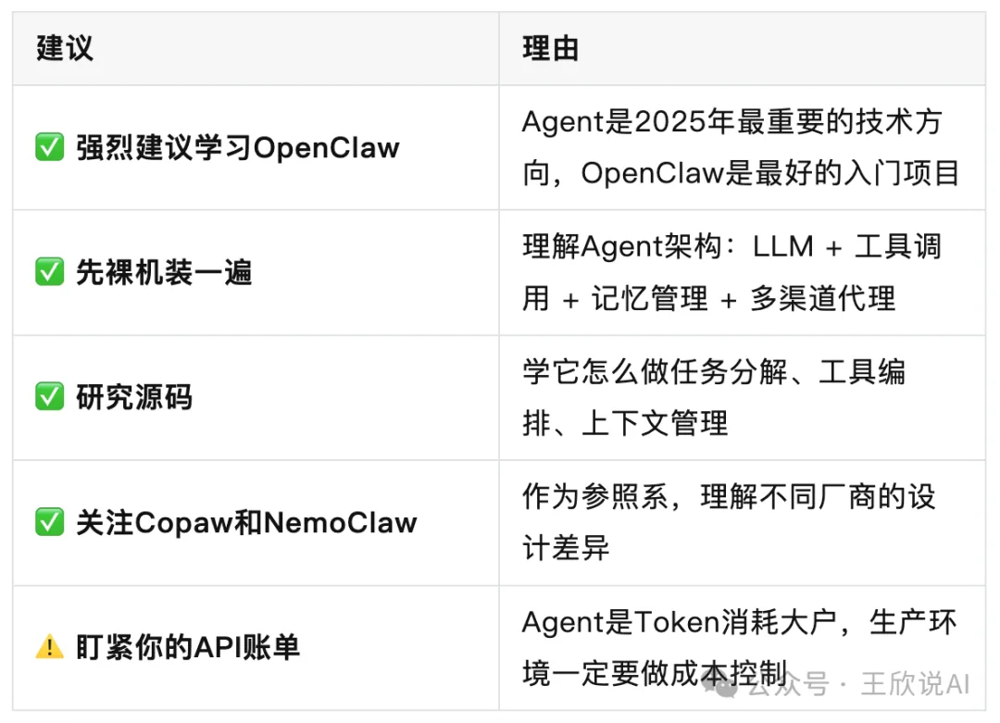

## 👨‍👩‍👦 给普通人

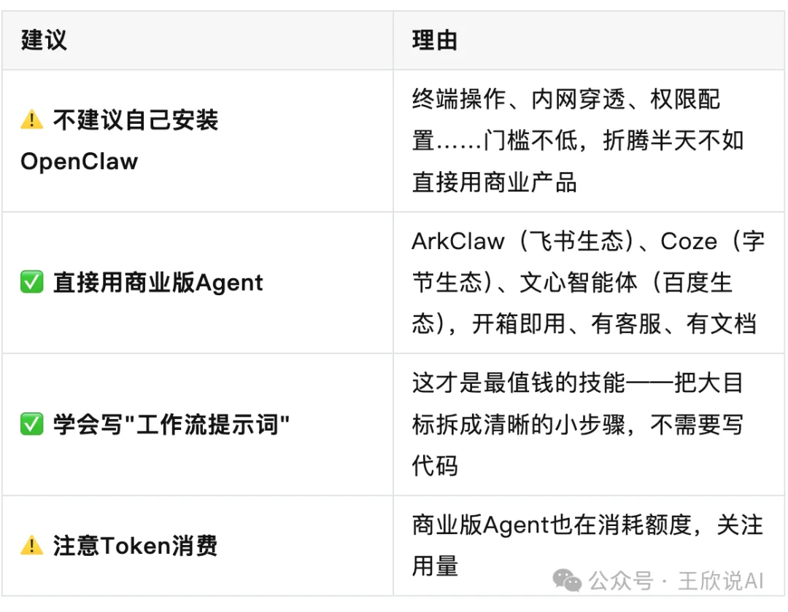

## 🤔 要不要学龙虾？

> **程序员 -> 现在就学，越早越好。**
>
> **普通人 -> 用商业版就好，把精力花在"怎么给Agent下好指令"上。**

------

# 🎯 总结

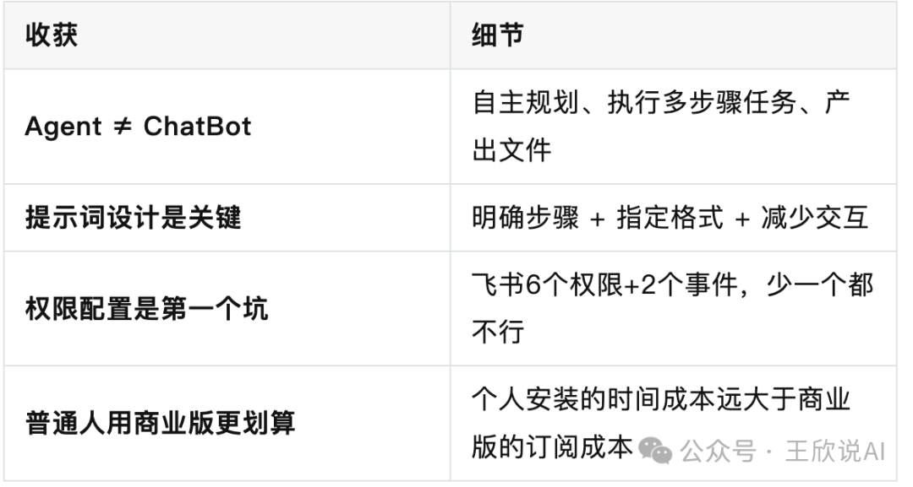

> 🦞 **一只开源龙虾，一个飞书机器人，13分钟，从小说到127个分镜头。AI Agent时代，不是未来，是现在。**
>
> 觉得有用？**点赞、在看、转发**，我们下篇见！

